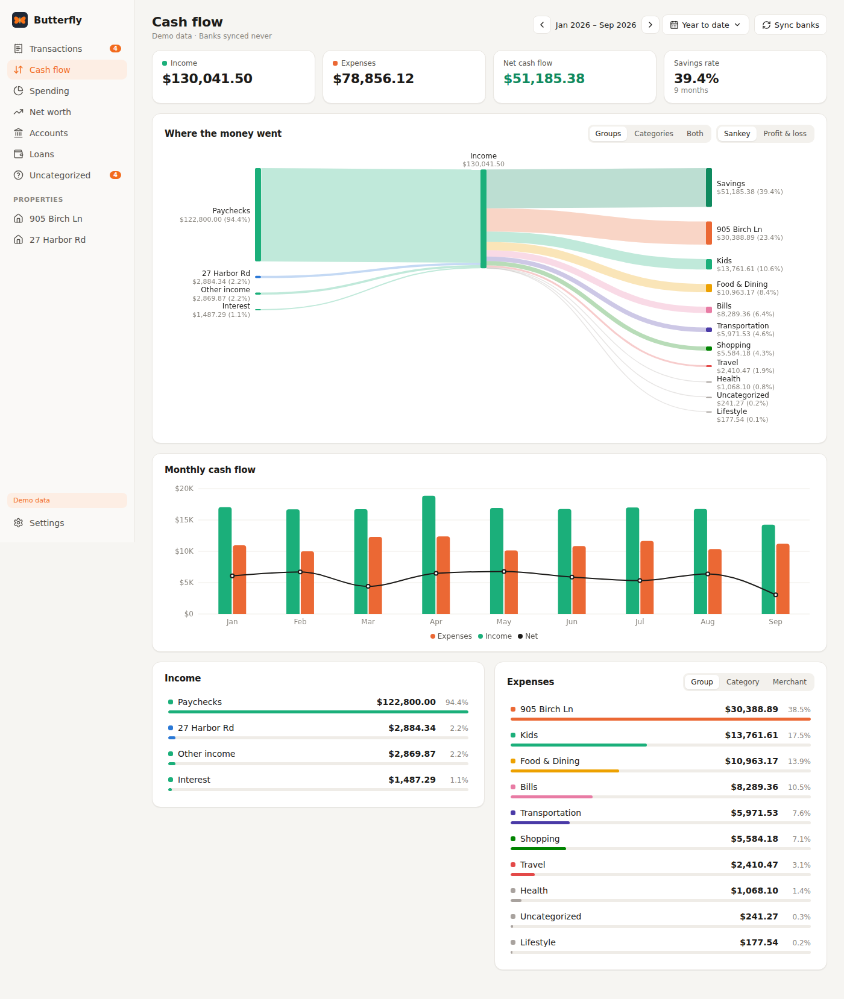
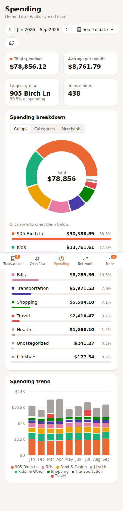
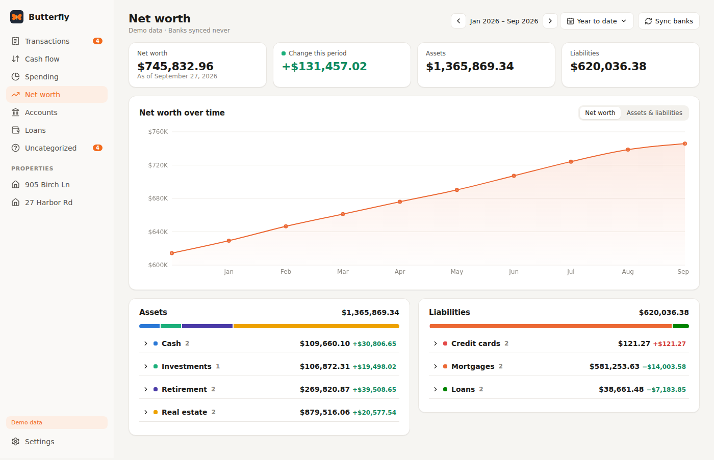

# Butterfly

A self-hosted, Monarch-style personal finance dashboard that sits on top of [Actual Budget](https://actualbudget.org). Banks sync into Actual through SimpleFIN; Butterfly reads your budget from your own Actual server and gives you a nicer way to look at it. Your data never leaves your network.



## What's in it

- **Cash flow**: income, expenses, net and savings rate for any period, a Sankey of where the money went (by group, category or both), a profit and loss view, and month-by-month bars.
- **Spending**: donut and ranked breakdown by group, category or merchant, plus a stacked monthly trend. Click rows to chart just those.
- **Transactions**: every account in one searchable list, grouped by day, with filters for uncategorized, split and transfer transactions. Changing a category writes it back to Actual.
- **Net worth**: net worth over time, assets and liabilities by type, and change for the period.
- **Accounts** and **Loans**: balances with sparklines, principal vs. interest paid, and an estimated payoff date for each loan.
- **Property pages**: one page per property with its monthly cash flow, biggest expenses, equity and transactions. Rentals can be set to "net only", so just the profit or loss reaches your main cash flow and spending instead of every repair bill.
- Works on your phone (bottom tab bar), has a dark mode, and an optional password.

With no Actual settings it runs on a built-in demo household, so you can try it right away.

 

## Deploying on Unraid

Every push to `main` builds and publishes the image to `ghcr.io/wmhunter96/butterfly:latest` via [GitHub Actions](.github/workflows/docker-publish.yml). An [Unraid template](unraid/butterfly.xml) is included so the container installs and updates through the normal Docker UI.

**One-time setup:**

1. On GitHub, go to the repo's **Packages** tab → `butterfly` package → **Package settings** → change visibility to **Public**. GHCR packages start private, and a private image needs a login on the Unraid side to pull. The image contains only the app; your financial data lives in `/config` on your server.
2. Add the template. If this repo is public: **Docker** tab → **Template Repositories** → add `https://github.com/wmhunter96/Butterfly` → **Save**. If the repo is private, copy [`unraid/butterfly.xml`](unraid/butterfly.xml) to `/boot/config/plugins/dockerMan/templates-user/my-butterfly.xml` on the flash drive instead.
3. **Docker** → **Add Container** → pick **Butterfly** from the template dropdown. Fill in the Actual settings below (or leave them empty for demo data), then **Apply**.
4. Open `http://<unraid-ip>:3000`.

**After that:** any push to `main` refreshes the `latest` tag, and Unraid's normal update check offers the update.

Prefer compose? `docker-compose.yml` is included: copy `.env.example` to `.env`, fill it in, and `docker compose up -d`.

## Connecting to Actual Budget

You need a running Actual server (for example the `actualbudget/actual-server` container from Community Applications) with SimpleFIN linked inside Actual (**Settings → Bank sync** in Actual).

| Setting | Where to find it |
|---|---|
| `ACTUAL_SERVER_URL` | The address you open Actual at, e.g. `http://192.168.1.10:5006` |
| `ACTUAL_PASSWORD` | The password you log in to Actual with |
| `ACTUAL_SYNC_ID` | In Actual: **Settings → Show advanced settings → Sync ID** |
| `ACTUAL_ENCRYPTION_PASSWORD` | Only if the budget uses end-to-end encryption |
| `APP_PASSWORD` | Optional password for Butterfly itself |
| `CACHE_SECONDS` | How long data is reused between page loads (default 60) |

The **Sync banks** button asks Actual to run its SimpleFIN sync, then reloads.

## Making it yours

Open **Settings** in the app:

- **Properties**: any Actual category group whose name starts with a street number (like `412 Maple St`) becomes a property page automatically, along with income categories that mention it (like `412 Maple St Rent`) and accounts whose names mention it (value and mortgage accounts). You can add, rename or re-map properties and choose which ones are "net only".
- **Account types**: Butterfly guesses from names (cash, credit card, investment, retirement, real estate, mortgage, loan). Fix any it gets wrong, and add a loan's APR for a sharper payoff date.

Settings are stored in `/config/settings.json`.

How the numbers are counted: only on-budget accounts feed cash flow and spending; transfers between your own accounts are ignored unless they carry a category (like a mortgage payment to an off-budget loan account); off-budget accounts (investments, home values, loans) show up in net worth, accounts and loans.

## Security

Butterfly shows your whole financial picture, so keep it on your LAN or behind a VPN such as Tailscale rather than exposing it to the internet, and set `APP_PASSWORD` if others share your network.

## Development

```bash
npm install
npm run dev:server   # API on :3000 (demo data unless ACTUAL_* are set)
npm run dev          # UI on :5173 with hot reload, proxies /api to :3000
npm run build        # typecheck + production build into dist/
npm start            # serve dist/ and the API on :3000
```

The server is `server/` (Express plus `@actual-app/api`); the UI is `src/` (React, Recharts, d3-sankey).
